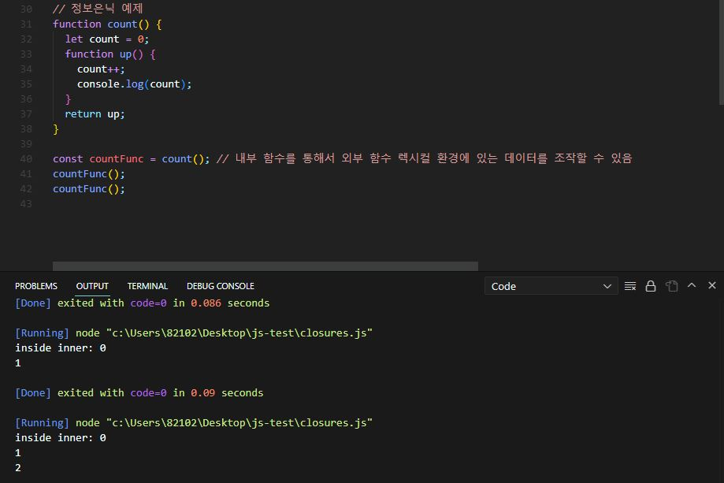
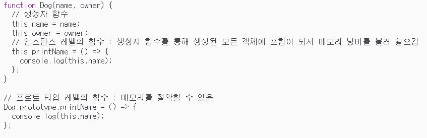

# Algorithm & CS 지식을 쌓자

## 진행 기간: 2023년 6월 1일 → Ing  

## 무슨 일이 있어도 하루 한문제는 풀고 CS지식을 정리하자!  

<!-- ## 비트

- 정보를 저장하고 연산을 수행하기 위해 컴퓨터는 비트(bit)라는 측정 단위를 씀
- 비트는 이진 숫자라는 뜻을 가진 'binary digit'의 줄임말임
- 0과 1, 두 가지 값만 가질 수 있는 측정 단위

## 비트열

- 여러 숫자 조합을 컴퓨터에 나타내기 위해 비트열을 사용함
- 바이트(byte)는 여덟 개의 비트가 모여 만들어진 것

 -->

## HTML은 무엇의 약자이고 어떤 걸 의미하는지 또한 HTML 파일에서 `<!DOCTYPE html>` 이 의미하는 걸 설명해 주세요.

HTML은 Hypertext Markup Language의 약어로 페이지와 그 내용을 구조화하기 위해 사용하는 마크업 언어입니다. 또한 HTML 파일의 최상단에 선언하는 `<!DOCTYPE html>`이 의미하는 것은 Document Type의 약어로 HTML 문서가 어떤 버전의 HTML 또는 XHTML로 작성되었는지 브라우저에게 알려주는 선언문입니다. 선언의 목적은 각 브라우저가 HTML 문서를 동일하게 인식할 수 있도록 하고, 문서 간의 호환성을 높이기 위함입니다.

## CSS는 무엇의 약자이고 어떤 걸 의미하는지 설명해 주세요.

CSS는 Cascading Style Sheets의 약자입니다. CSS는 웹 페이지의 디자인과 레이아웃을 꾸미는 역할을 합니다. 또한 "Cascading"이라는 용어가 포함된 이유는, 여러 개의 스타일 규칙이 적용될 때 우선순위를 결정하는 데에 있어서 위에서부터 아래로 적용되는 효과들이 마치 흐르는 폭포와 같은 특성을 갖기 때문입니다.

## var, let, const 차이를 설명해 주세요.

var : 변수를 선언하는 키워드로, 중복 선언이 가능하고, 변수의 값이 변할 수 있습니다. 이로 인해 변수의 값이 예기치 않게 변경되어 추적하기 어려울 수 있으며, 호이스팅이라는 개념으로 인해 변수가 선언되기 전에도 사용될 수 있습니다.
let : 블록 스코프 변수를 선언하는 키워드로, 중복 선언이 불가능하며 변수의 재할당이 가능합니다.
const : 블록 스코프 변수를 선언하는 키워드로, 선언과 동시에 초기화가 되어야 합니다. 중복 선언과 변수의 재할당이 모두 불가능합니다. 그러나 객체나 배열과 같은 복합 데이터 타입의 경우에는 해당 객체나 배열의 내용이 변경되지 않는다는 보장만 있을 뿐이며, 객체나 배열의 참조 값은 변경 가능합니다.

## 호이스팅(Hoisting)이 무엇인지 설명해 주세요.

코드 실행 단계에서 변수와 함수 선언이 해당 스코프의 맨 위로 끌어올려지는 현상을 설명합니다. 이로 인해 변수와 함수 선언이 실제 코드의 위치와 상관없이 해당 스코프 내에서 최상단에 있는 것처럼 동작하게 되고 변수를 선언전에 호출하면 Uncaught ReferenceError 와 같이 선언되지 않았다고 오류를 출력해 줘야 하는데 undefined를 출력하기 때문에 사용자에게 혼동을 줄 수 있습니다.

## 브라운저 렌더링 원리

웹 브라우저에서 웹 페이지를 로드할 때, 브라우저는 서버로부터 HTML 파일과 CSS 파일을 다운로드합니다. HTML 파일은 브라우저에서 파싱되어 Document Object Model (DOM)으로 변환됩니다. DOM은 웹 페이지의 구조를 표현하는 트리 구조입니다.

CSS 파일은 브라우저에서 파싱되어 CSS Object Model (CSSOM)으로 변환됩니다. CSSOM은 CSS 규칙과 스타일 정보를 나타내는 객체 모델입니다. 이 모델은 웹 페이지의 요소에 적용되는 스타일을 계산하고 적용하는 데 사용됩니다.

HTML과 CSS 파일이 파싱되고 DOM과 CSSOM으로 변환되면, 브라우저는 DOM과 CSSOM을 결합하여 렌더 트리(Render Tree)를 생성합니다. 렌더 트리는 화면에 실제로 표시되는 요소들을 포함한 최종 레이아웃을 나타냅니다.

렌더 트리가 생성되면 브라우저는 렌더 트리를 사용하여 요소들의 위치와 스타일을 계산하고 화면에 그려줍니다.

## 'getStaticProps'와 'getServerSideProps'의 차이

- getStaticProps: 이 메서드는 정적 생성(Static Generation)을 사용하는 페이지에 사용됩니다. 정적 생성은 빌드 시점에 페이지를 렌더링하고 미리 생성된 HTML 파일을 제공하는 방식입니다. 이렇게 생성된 페이지는 정적인 상태로 유지되며, 서버에 요청이 발생하지 않습니다. getStaticProps를 사용하여 데이터를 가져오면, 빌드 시점에 한 번 호출되며 데이터가 페이지에 미리 로드됩니다. 그러나 이미지와 같은 동적인 요소의 경우, 빌드 시점에서 로드할 데이터가 없어 문제가 발생할 수 있습니다.

- getServerSideProps: 이 메서드는 서버 측 렌더링(Server-Side Rendering, SSR)을 사용하는 페이지에 사용됩니다. SSR은 클라이언트 요청이 있을 때마다 서버에서 페이지를 렌더링하고 HTML을 동적으로 생성하여 제공하는 방식입니다. getServerSideProps를 사용하여 데이터를 가져오면, 각 요청마다 호출되며 최신 데이터를 사용하여 페이지를 렌더링합니다. 따라서 이미지와 같은 동적인 요소도 정상적으로 로드됩니다.

## 정적 요소(Static Elements) & 동적 요소(Dynamic Elements)

정적 요소(Static Elements):

- 텍스트: 사이트의 로고, 제목, 설명 등과 같은 고정된 텍스트 요소는 정적 요소입니다. 이러한 요소는 변경되지 않고 페이지를 로드할 때 항상 동일하게 표시됩니다.
- 이미지: 사이트 로고, 배경 이미지, 아이콘 등과 같은 이미지 요소도 정적 요소입니다. 한 번 업로드되면 변경되지 않고 고정된 이미지로 사용됩니다.
- CSS 스타일: 사이트의 스타일 시트, 디자인, 레이아웃 등과 같은 CSS는 정적 요소입니다. 이러한 요소는 페이지 로드 시 고정되어 동일한 스타일이 적용됩니다.

동적 요소(Dynamic Elements):

- 사용자 정보: 로그인 상태, 사용자 이름, 프로필 사진 등과 같은 사용자 정보는 동적 요소입니다. 사용자가 로그인한 후에만 표시되며, 로그인 상태에 따라 변경됩니다.
- 실시간 데이터: 주식 시세, 날씨 정보, 뉴스 피드 등과 같은 실시간으로 업데이트되는 데이터는 동적 요소입니다. 이러한 데이터는 서버에서 가져와서 페이지를 동적으로 업데이트합니다.
- 사용자 입력: 검색어 입력, 폼 작성 등과 같은 사용자 입력은 동적 요소입니다. 사용자가 입력한 내용에 따라 페이지가 동적으로 반응하고 업데이트됩니다.

## 브라우저 주소창에 '구글'을 입력했을 때

1. 브라우저는 입력된 주소를 해석하고 해당 도메인으로 요청을 보냄
2. DNS(Domain Name System)서버에 도메인 이름을 확인하도록 요청

- DNS는 도메인 이름을 해당하는 IP주소로 변환해주는 역할을 함

3. DNS서버에서 '구글'에 대한 IP 주소를 찾아 브라우저에 응답 함
4. 브라우저는 응답받은 IP 주소를 사용하여 해당 서버로 요청을 보냄
5. 구글 서버에서는 요청을 받고 웹 페이지의 내용과 데이터로 응답 함

## RESTful API

- Representational State Transfer(표현 상태 전송)의 약어
- 웹 서비스와 클라이언트 간의 통신을 위한 아키텍처 스타일입니다.
- 네트워크 기반의 시스템들 간에 상호 작용을 가능하게 하며, 웹 개발에서 가장 일반적으로 사용되는 API 디자인 원칙 중 하나입니다.

## GET과 POST의 차이 점

- HTTP 프로토콜에서 "GET"과 "POST"는 서버와 클라이언트 간에 데이터를 주고 받을 때 사용되는 주요한 메서드 입니다. "GET"은 데이터를 요청하는데 사용되고 "POST"는 데이터를 서버로 제출하는데 사용됩니다. 두 메서드에 가장 큰 차이점은 보안 차이라고 생각합니다. "GET"은 URL에 파라미터를 노출시키고, "POST"는 URL에 데이터를 노출시키지 않습니다.

이미지 출처 : https://velog.io/@welchs1423/GET-POST-%EB%B0%A9%EC%8B%9D%EC%9D%98-%EC%B0%A8%EC%9D%B4
  

## 객체지향 프로그래밍이란?

- 객체지향 프로그래밍(Object-Oriented Programming, OOP)은 소프트웨어 개발 방법론 중 하나로, 프로그램을 객체(Object)들의 집합으로 모델링하고, 객체들 간의 상호작용을 통해 프로그램을 구현하는 방법입니다.

- 객체지향 프로그래밍의 주요 특징

1. 캡슐화(Encapsulation): 데이터와 해당 데이터를 처리하는 메서드를 하나의 단위로 묶어 정보를 은닉하고, 외부에서 직접 접근하지 못하도록 보호합니다.

2. 상속(Inheritance): 기존의 클래스를 확장하거나 재사용하여 새로운 클래스를 만들 수 있습니다. 상속을 통해 코드의 재사용성이 증가하며, 계층적인 관계를 구성할 수 있습니다.

3. 다형성(Polymorphism): 같은 이름의 메서드를 다양한 객체에서 다르게 동작하도록 구현할 수 있습니다. 이는 코드의 유연성과 확장성을 제공하며, 코드의 가독성을 높입니다.

4. 추상화(Abstraction): 객체들의 공통적인 특성을 추출하여 모델링하고, 불필요한 세부 사항을 숨기는 과정을 말합니다. 이를 통해 복잡한 시스템을 단순화하고 이해하기 쉬운 모델로 만들 수 있습니다.

 

## 프로세스(Process)와 스레드(Thread)

- 프로세스(Process)와 스레드(Thread)는 컴퓨터에서 실행되는 작업 단위를 의미하는 용어입니다

프로세스:

- 운영체제로부터 자원을 할당받은 독립적인 실행 단위입니다.
- 각각의 프로세스는 독립된 메모리 공간을 가지며, 서로 영향을 주지 않습니다.
- 각 프로세스는 개별적으로 실행되며, 별도의 주소 공간, 파일 핸들, 시스템 자원 등을 보유합니다.
- 프로세스 간에는 통신을 위해 명시적인 메커니즘이 필요합니다(예: 파이프, 소켓 등).

스레드:

- 하나의 프로세스 내에서 실행되는 작은 실행 단위입니다.
- 스레드는 프로세스의 자원을 공유하면서 실행됩니다.
- 같은 프로세스 내의 스레드는 동일한 주소 공간과 파일 핸들 등을 공유합니다.
- 스레드는 병렬적으로 실행될 수 있으며, 여러 스레드 간에는 공유 데이터에 대한 동기화가 필요합니다.

## 클로저(Closures)

- 클로저란? 내부 함수에서 외부 함수에 맥락에 접근할 수 있는 것을 의미 함
- 그렇다면 일반적인 함수 환경에서 전역 변수를 가리키는 것 모두 클로저인가?
- 아닙니다! 클로저는 외부 함수 안에 내부 함수가 묶여있는 것 처럼 폐쇄적인 느낌을 주는 것이 클로저임
- 클로저를 통해서 할 수 있는 것 : 캡슐화를 통해 정보를 은닉할 수 있음

클로저 예제

## 콜백 지옥

- 비동기 로직 처리 중 무분별하게 연속해서 사용할 때 발생 함
- 문제점 : 코드의 가독성이 떨어지고 예외처리의 복잡도가 증가 함
- 해결 방법 : 콜백 지옥을 해결하기 위한 방법은 promise 문법이나 async/await 문법을 이용할 수 있는데 저 같은 경우는 promise 문법과 async/await 문법을 둘 다 경험해 본 결과 promise 문법의 장점은 상황에 따른 대처가 편합니다. 비동기 통신을 중인 Pending, 비동기 통신을 성공했을 때인 Fulfilled와 실패했을 때인 Rejected를 따로 처리할 수 있습니다. 하지만 promise 문법 또한 코드가 길어지다 보면 이전에 작성했던 콜백 지옥과 마찬가지로 코드가 길어질 수 있기 때문에 이러한 문제 점을 해결하기 위해 나온 것이 async/await 문법인데 사용해 본 결과 정말 코드가 간결해고 비동기 통신 결과 값도 쉽게 받아 볼 수 있습니다. 하지만 단점은 에러 핸들링을 따로 하려면 try catch 문안에서 해야 한다는 단점이 있습니다.

## 스코프

- 전역 스코프(Global Scope) : 어느 곳에서든 해당 변수로 접근이 가능
- 지역 스코프(Local Scope) : 해당 지역(함수) 내에서만 접근이 가능
- 클로져 : 내부함수가 외부함수의 맥락에 접근할 수 있는 것
- 클로져가 필요한 이유 : 불필요한 전역변수를 줄이고 코드의 재사용성을 높이기 위함

## var let const의 차이점

- var : 변수의 중복 선언이 가능하여 변수에 할당된 값이 변할 수 있음 그렇기 때문에 오류를 추적하기가 힘들어짐, 호이스팅 오류가 발생 함
- let : 변수의 중복 선언이 불가능하고, 재 할당은 가능함
- const : 선언과 초기화가 동시에 일어나야 함, 변수의 중복 선언과, 재 할당 모두 불가능함 단 객체는 가능함

## 호이스팅

- 자바스크립트에서 호이스팅이란? 인터프리터가 변수와 함수의 메모리 공간을 선언 전에 미리 할당하는 것 으로 인해 var로 변수를 선언한 뒤 선언 전인 위에서 변수를 호출 하게 되면 참조 오류가 발생해야 하는데 undefiend가 출력 되는 것이 호이스팅임

## 얕은 복사 | 깊은 복사

- 얕은 복사: 참조에 의한 할당, 해당 데이터의 참조 값(메모리 주소)을 전달하는 방식으로 하나의 데이터를 공유함
- 깊은 복사: 깊은 복사를 하기 위해서 ...(spread)연사자를 통해서 객체나 배열을 복사한 적이 있습니다. 1depth까지는 값이 완벽하게 복사가 되어서 복사한 객체의 프로퍼티를 수정하여도 원본 객체나 배열에는 영향을 주지 않았었지만 2depth에 있는 프로퍼티를 수정하면 원본 객체나 배열도 영향을 받았습니다. 이 점을 해결하기 위해 lodash모듈의 cloneDeep()함수를 통해서 객체나 배열을 완벽하게 복사 할 수 있었습니다.

## 프로토 타입

- 자바스크립트는 객체지향 언어인데 클래스 개념을 갖고있지 않습니다. 하지만 객체 지향언어에서 빠질 수 없는 특징이 상속인데 상속성을 유지하기 위해 자바스크립트에서 이용하는 것이 프로토 타입 입니다.
- 프로토 타입을 사용하는 이유는 상속 개념을 활용해서 코드를 재사용하기 위함입니다.

## 타입스크립트를 사용하는 이유?

- 정적 타입(미리 타입을 지정)언어 이기 때문에 컴파일 단계에서 오류를 잡을 수 있기 때문에 자바스크립트의 큰 단점을 보완해 줌
- 타입을 미리 지정해주기 때문에 메모리를 절약 할 수 있음
- 타입을 미리 지정해주는게 왜 메모리를 줄일 수 있는걸까? 그 이유는 자바스크립트에서는 특정한 타입에는 메모리를 가장 크게 할당해 주기 때문에 타입 스크립트를 이용해서 타입을 미리 지정해주면 메모리를 최소화 할 수 있는 것이다.
- 브라우저 호환성 문제를 해결 할 수 있음 컴파일 과정에서 ES6+ 문법을 ES5 또는 ES3로 변경 해줌

## TDZ(Temporal Dead Zone)

- 자바스크립트의 변수는 선언 -> 초기화 -> 할당 과정을 거치는데 TDZ는 선언 ~ 초기화 단계의 사이를 뜻 함
- 런타임 전에 선언단계가 미리 선언이 되지만 초기화 단계 이전에 호출하면 참조오류가 발생 함

## 리액트의 Lifecycle API

- Mounting(컴포넌트가 브라우저 상에 나타날 때) : componentDidMount
- Updating(컴포넌트의 props나 state가 업데이트 될 때) : componentDidUpdate
- UnMounting(컴포넌트가 브라우저 상에서 사라질 때) : componentWillUnmount

## JSX(JavaScriptXML)

- 자바스크립트에 XML을 추가한 것 (XML: eXtensibel Markup Language)
- 공식적인 자바스크립트 문법이 아님
- 왜 쓰는가? 하나의 파일에서 자바스크립트와 Html을 동시에 이용할 수 있음

## React Hook

- Class Component의 불편한을 해결하기 위해 Functional Component를 사용하는 리액트 훅이 등장 함
- 함수형 컴포넌트에서도 state를 가질 수 있게 해줌
- 즉 class컴포넌트에서 사용하는 did mount, render등을 안해도 됨
- 리액트 훅을 통해서 함수형 컴포넌트에서도 클래스형 컴포넌트의 작업들을 수행할 수 있음

## Redux

- 리액트에는 이미 setState(), 리액트 훅스의 useState() 등이 상태를 관리할 수 있는데 redux를 사용하는 이유는?

- 모든 컴포넌트에서 props를 통해서 정보를 전달받는 것이 아니라 store에서 상태를 꺼내서 사용할 수 있어서 굉장히 편리하고 코드량도 줄어듭니다. 저는 주로 Redux에 편의 기능이 추가 된 Redux-toolkit을 이용했는데 로그인 후 유저 정보 관리를 할 때 굉장히 간편했던 것 같습니다.

- Redux Toolkit 사용 법 :

1. Redux 스토어를 설정합니다. configureStore 함수를 사용하여 스토어를 생성하고 필요한 미들웨어 및 리듀서를 추가합니다.
2. 슬라이스 생성: Redux Toolkit에서 슬라이스(slice)는 상태(state)와 리듀서(reducer)를 결합한 개념입니다. createSlice 함수를 사용하여 슬라이스를 생성하고, 해당 슬라이스의 초기 상태와 리듀서를 정의합니다.
3. 액션 생성자 생성: Redux Toolkit은 액션 생성자를 자동으로 생성해주는 기능을 제공합니다. createSlice 함수를 사용하면 액션 생성자를 자동으로 생성하고, 리듀서 내부에서 액션을 처리할 수 있도록 도와줍니다.
4. 컴포넌트에서 Redux 사용: Redux Toolkit으로 설정한 스토어를 컴포넌트에서 사용할 수 있습니다. react-redux 라이브러리의 Provider 컴포넌트로 스토어를 제공하고, useSelector 훅을 사용하여 상태를 가져오고, useDispatch 훅을 사용하여 액션을 디스패치할 수 있습니다.

## Props와 State의 차이

- props와 state의 가장 큰 차이는 props는 부모 컴포넌트에서 상속 받는 데이터이기 때문에 직접 수정이 불가능합니다. 그에 반해 state는 컴포넌트 내부에서 생성되고 값을 수정할 수 있습니다.

## SSR(Server Side Rendering) VS CSR(Client Side Rendering)

- SSR: 페이지내용을 서버에서 그린 다음 브라우저로 전달, 페이지를 이동할 때마다 서버에 새로운 페이지를 요청
- CSR: 페이지의 내용을 브라우저에서 그림, React를 예로보면 index.js파일만 로드 하고 내용만 바뀜 => SPA(Single Page Application)
- SEO에 단점이 있음, 웹봇이 크롤링 할 때는 웹이 로드되기 이전에 빈 상태 코드를 크롤링 해가기 때문

## 완벽한 DeepCopy

- const object = {name:엄성준, age:25, food:{us:pizza, jp: ramen}}
- 위와 같이 선언 및 할당이 된 객체가 있을 때 어떻게 깊은 복사를 해야 될까?라는 고민을 해보았는데 일반적으로 1depth만 복사할 때는 spread 연산자를 통해서 const object2 = {... object1}을 통해서 복사하면 되지만 이렇게 복사할 시 문제점이 있습니다. object2의 객체 안의 객체 즉 2depth에 있는 food의 객체 요소를 변경하게 되면 원본 객체 object의 food 요소에도 영향을 준다는 겁니다. 2depth에도 영향을 안주는 완벽한 DeepCopy를 하기 위해서는 lodash 모듈의 cloneDeep(object)를 이용해서 원본 배열을 복사해 주면 완벽한 깊은 복사를 할 수 있다는 걸 알게 되었습니다!

## < !DOCTYPE html > 태그의 의미

- HTML 문서의 첫 줄에 위치하는 선언문입니다.
- DOCTYPE은 Document Type의 약어로, 문서 유형을 나타냅니다.
- 한 줄로 표현 하면 이 선언문은 웹 브라우저에게 현재 문서가 HTML이라는 종류의 문서임을 알려주는 문장입니다.

## CSS(Casecading Style Sheets)란?

- CSS는 Cascading Style Sheets의 약자입니다. 그렇다면 Cascading의 의미는 무엇일까요? Cascading의 의미는 폭포입니다. 폭포는 위에서 아래로 떨어지는 뜻을 의미합니다.

## 자바스크립트의 프로토타입

- 프로토타입(prototype)의 정의는 원래의 형태 또는 전형적인 예, 기초 또는 표준이다.
- 모든 객체는 내부에 숨겨진 [[Prototype]]을 가지고 있습니다.
- 객체와 배열 모두 Object로 부터 프로토타입 체인으로 연결되어 있기 때문에 Array는 Object로부터 메서드를 상속받기 때문에 배열 메서드 concat(), filter(), map() && object 메서드 toString(), valueOf(), watch()등 과 같은 메서드도 사용할 수 있는 겁니다.
- Object.freeze는 동결을 의미하는데 객체의 요소 중 1Depth즉 얕은 요소들에게만 불변성을 부여합니다. 여기서 말하는 불변이란 객체의 내용을 수정하거나 삭제하거나 업데이트 할 수 없습니다.
- Object.seal은 밀봉을 의미하는데 객체안에 value는 수정할 수 있지만 추가나 수정 및 삭제는 불가 합니다.
- Object.preventExtensions는 영어 의미 그대로 상속 즉 확장을 금지 시키는 메서드 입니다.

- 생성자 함수에서 인스턴스 레벨의 함수와 프로토타입을 통해서 생성한 함수의 차이는 무엇일까? 두 함수의 차이는 인스턴스 레벨의 함수를 선언했을 때 생성자 함수를 통해서 생성 된 객체들은 모두 그 함수를 갖게 될 것입니다. 이렇게 되면 사용하지 않는 객체들도 메모리를 차지 하고 있기 때문에 이는 메모리 손실을 가져올 수 있습니다. 하지만 생성자 함수의 프로토타입을 통해서 함수를 생성한다면 모든 생성 객체들은 메서드도 사용할 수 있고 메모리도 차지 하지 않아서 프로토 타입을 통해서 메모리를 크게 절약할 수 있습니다.
